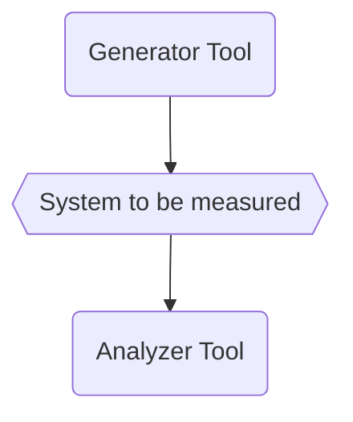

SigQual
=======

A set of tools to validate the integrity and quality of media recordings.

```mermaid
graph TD;
    G(Generator Tool);
    S{{System to be measured}};
    A(Analyzer Tool);

    G-->S-->A;
```

